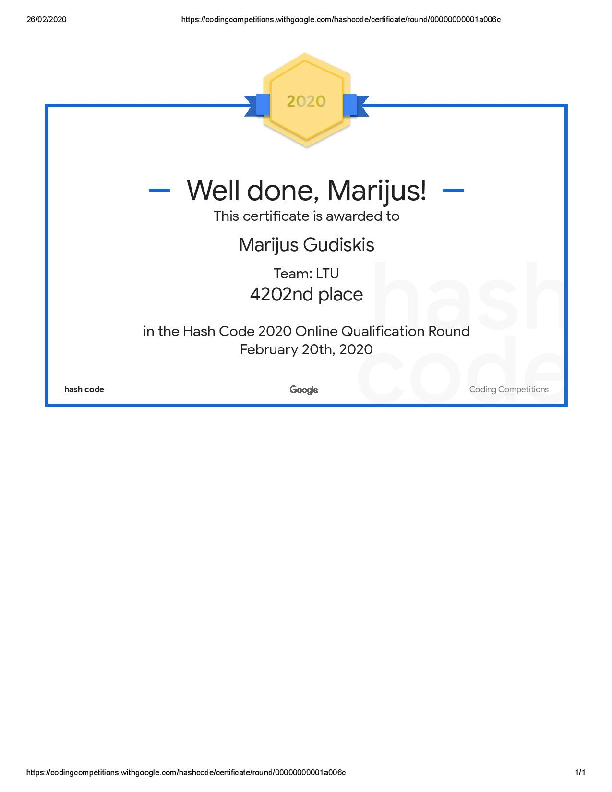

# Google-Hash-2020
This is the Google hash 2020 code with libraries, the main part(not the extended one). Our team name was LTU and we took 4202 place out of 10724 in the world and we took 9th place out of 35 Swansea University groups and our score was 20,746,109. I should say that the code was written entirely by me, my teammates lacked the experience and knowledge to help me, but they did try, so I'm not mad.

